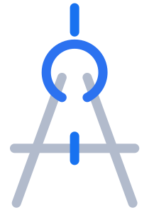

<!-- PROJECT LOGO -->
<br />
<div align="center">
  <a href="https://gitlab.com/cadbase/cdbs-app">
    
  </a>

  <h3>Frontend for CADBase Platform</h3>

  <p>
    CADBase is a digital platform for sharing 3D models and drawings!
    <br />
    <a href="https://gitlab.com/cadbase/cdbs-app">View site</a>
    ·
    <a href="https://gitlab.com/cadbase/cdbs-app/issues">Report Bug</a>
    ·
    <a href="https://gitlab.com/cadbase/cdbs-app/issues">Request Feature</a>
  </p>
</div>


<!-- TABLE OF CONTENTS -->
<details>
  <summary>Table of Contents</summary>
  <ol>
    <li>
      <a href="#about-the-project">About The Project</a>
      <ul>
        <li><a href="#built-with">Built With</a></li>
      </ul>
    </li>
    <li>
      <a href="#getting-started">Getting Started</a>
      <ul>
        <li><a href="#prerequisites">Prerequisites</a></li>
        <li><a href="#installation">Installation</a></li>
      </ul>
    </li>
    <li><a href="#usage">Usage</a></li>
    <li>
      <a href="#test">Test</a>
      <ul>
        <li><a href="#preparing">Preparing</a></li>
        <li><a href="#run">Run</a></li>
      </ul>
    </li>
    <li><a href="#roadmap">Roadmap</a></li>
    <li><a href="#contributing">Contributing</a></li>
    <li><a href="#license">License</a></li>
    <li><a href="#contact">Contact</a></li>
    <li><a href="#acknowledgments">Acknowledgments</a></li>
  </ol>
</details>


<!-- ABOUT THE PROJECT -->
## About The Project

[![Product Name Screen Shot][product-screenshot]](https://cadbase.rs)

Here contains the code for site the CADBase. This digital platform for sharing 3D models, drawings, standards, supplier information, and other engineering data.

At first glance, it may seem that all the tasks of exchanging 3D models, drawings and other engineering data, taking into account their versioning and availability, have already been solved by existing solutions.

However, I hope that the CADBase project will find its niche for the following reasons: 
* Specific dependency between data to simplify the work when using different CAD systems
* API functionality is available to all users of the platform 
* Ability to integrate the platform with various design systems and other solutions

We have a rather ambitious goal: to create a solution for the exchange of design data suitable for most of engineers.

We also have a YouTube channel <a href="https://www.youtube.com/channel/UC-dHiTHBGV88ScxFKSC3srw">CADBase Platform</a> if you're interested.

If you do not see interest in this site and its functionality, you can try to benefit from the code base of this site. In any case, have peace and goodness ;)

<div align="right">(<a href="#about-the-project">back to top</a>)</div>


### Built With

To create this part of the project, were used
<a href="https://yew.rs"></a>  <a href="https://bulma.io"></a>

| Libraries used |
| ------------- |
| [![router][router]][router-url] [![yewtil][yewtil]][yewtil-url] [![bindgen][bindgen]][bindgen-url] [![logger][logger]][logger-url] [![instant][instant]][instant-url] [![lipsum][lipsum]][lipsum-url] [![log][log]][log-url] [![getrandom][getrandom]][getrandom-url] [![rand][rand]][rand-url] [![chrono][chrono]][chrono-url] [![dotenv_codegen][dotenv_codegen]][dotenv_codegen-url] [![lazy_static][lazy_static]][lazy_static-url] [![parking_lot][parking_lot]][parking_lot-url] [![cmark][cmark]][cmark-url] [![serde][serde]][serde-url] [![regex][regex]][regex-url] [![serde_json][serde_json]][serde_json-url] [![thiserror][thiserror]][thiserror-url] [![graphql_client][graphql_client]][graphql_client-url] [![wee_alloc][wee_alloc]][wee_alloc-url] [![web-sys][web-sys]][web-sys-url] [![wasm-bindgen-test][wasm-bindgen-test]][wasm-bindgen-test-url] [![toml][toml]][toml-url] [![js-sys][js-sys]][js-sys-url] [![console_error_panic_hook][console_error_panic_hook]][console_error_panic_hook-url] [![anyhow][anyhow]][anyhow-url] |


Thank you to all contributors who have contributed to the above and to <a href="#acknowledgments">Acknowledgments</a> projects! Your input has allowed us to make CADBase better and faster.

<div align="right">(<a href="#about-the-project">back to top</a>)</div>


<!-- GETTING STARTED -->
## Getting Started

To start the frontend, you must perform the a few steps.

### Prerequisites

This is an example of how to list things you need to use the software and how to install them.
* [Rust](https://www.rust-lang.org/learn/get-started)

  ```sh
  curl --proto '=https' --tlsv1.2 -sSf https://sh.rustup.rs | sh
  ```
* [Trunk](https://trunkrs.dev/)

  ```sh
  # Install via homebrew on Mac, Linux or Windows (WSL).
  brew install trunk
  # Install a release binary (great for CI).
  # You will need to specify a value for ${VERSION}.
  wget -qO- https://github.com/thedodd/trunk/releases/download/${VERSION}/trunk-x86_64-unknown-linux-gnu.tar.gz | tar -xzf-
  # Install via cargo.
  cargo install --locked trunk
  # Until wasm-bindgen has pre-built binaries for Apple M1, M1 users will
  # need to install wasm-bindgen manually.
  cargo install --locked wasm-bindgen-cli
  ```

### Installation

Note: Before performing step 2, check the correct settings of the environment in the file '.env'.

1. Clone the repo
   ```sh
   git clone https://gitlab.com/cadbase/cdbs-app.git
   ```
2. Build, watch & serve the Rust WASM app and all of its assets
   ```sh
   trunk serve
   ```

<div align="right">(<a href="#about-the-project">back to top</a>)</div>


<!-- USAGE EXAMPLES -->
## Usage

We haven't yet opened the backend to a high-profile audience. But since the primary server API is available to all users, you can use these settings:

```
  API_BACKEND=https://api.cadbase.rs
  API_GPL=https://api.cadbase.rs/graphql
```

_Also please refer to the [API Reference](https://docs.cadbase.rs) if you want make more about API CADBase_

<div align="right">(<a href="#about-the-project">back to top</a>)</div>


<!-- RUN TESTS -->
## Test

If you want to run tests, a few tests are located in the 'tests' folder.

### Preparing

To run the tests, you will need to install the framework [TestCafe](https://testcafe.io/documentation).

```sh
  npm i testcafe
  # or (if you prefer yarn)
  yarn add testcafe
```

### Run

This example will run a login test that will be performed using the Firefox browser.

```sh
  npm testcafe firefox tests/login_test.js
  # or (if you prefer yarn)
  yarn testcafe firefox tests/login_test.js
```


<!-- ROADMAP -->
## Roadmap

- [x] Make an MVP
- [x] Make blanks for writing tests
- [ ] Add instructions for site users
- [ ] Add user interfaces to use all the basic API server functions
- [ ] Add 3D Viewer (such as [Three.js](https://github.com/mrdoob/three.js))
- [ ] Multi-language Support
    - [x] Russian
    - [ ] Chinese
    - [ ] Spanish

See the [open issues](https://gitlab.com/cadbase/cdbs-app/issues) for a full list of proposed features (and known issues).

<p align="right" style="text-align: right;">(<a href="#readme-top">back to top</a>)</p>


<!-- CONTRIBUTING -->
## Contributing

Contributions are what make the open source community such an amazing place to learn, inspire, and create. Any contributions you make are **greatly appreciated**.

If you have a suggestion that would make this better, please fork the repo and create a pull request. You can also simply open an issue with the tag "enhancement".
Don't forget to give the project a star! Thanks again!

1. Fork the Project
2. Create your Feature Branch (`git checkout -b feature/AmazingFeature`)
3. Commit your Changes (`git commit -m 'Add some AmazingFeature'`)
4. Push to the Branch (`git push origin feature/AmazingFeature`)
5. Open a Pull Request

<div align="right">(<a href="#about-the-project">back to top</a>)</div>


<!-- LICENSE -->
## License

Distributed under the MIT License. See `LICENSE.txt` for more information.

<div align="right">(<a href="#about-the-project">back to top</a>)</div>


<!-- CONTACT -->
## Contact

Ivan Nosovsky - in@cadbase.rs or `mnnxp#1839` (Discord)

Xia TianHao - xth@cadbase.rs or [Sansx](https://github.com/sansx) (GitHub)

<div align="right">(<a href="#about-the-project">back to top</a>)</div>


<!-- ACKNOWLEDGMENTS -->
## Acknowledgments

I find helpful this resources and 
Use this space to list resources you find helpful and would like to give credit to. I've included a few of my favorites to kick things off!

* [Yew-graphql-demo](https://github.com/sansx/yew-graphql-demo)
* [Webapp.rs](https://github.com/saschagrunert/webapp.rs)
* [Canduma](https://github.com/clifinger/canduma)
* [Font Awesome](https://fontawesome.com)
* [TestCafe](https://testcafe.io)
* [Best-README-Template](https://github.com/othneildrew/Best-README-Template)
* [Choose an Open Source License](https://choosealicense.com)
* [Img Shields](https://shields.io)

<div align="right">(<a href="#about-the-project">back to top</a>)</div>


<!-- MARKDOWN LINKS & IMAGES -->
<!-- https://www.markdownguide.org/basic-syntax/#reference-style-links -->
[product-screenshot]: data/1440_Main_default.png
[router]: https://img.shields.io/badge/router-blue
[router-url]: https://docs.rs/yew-router
[yewtil]: https://img.shields.io/badge/yewtil-blue
[yewtil-url]: https://docs.rs/yewtil
[bindgen]: https://img.shields.io/badge/bindgen-blue
[bindgen-url]: https://docs.rs/wasm-bindgen
[logger]: https://img.shields.io/badge/logger-blue
[logger-url]: https://docs.rs/wasm-logger
[instant]: https://img.shields.io/badge/instant-blue
[instant-url]: https://docs.rs/instant
[lipsum]: https://img.shields.io/badge/lipsum-blue
[lipsum-url]: https://docs.rs/lipsum
[log]: https://img.shields.io/badge/log-blue
[log-url]: https://docs.rs/log
[getrandom]: https://img.shields.io/badge/getrandom-blue
[getrandom-url]: https://docs.serde.rs/getrandom
[rand]: https://img.shields.io/badge/rand-blue
[rand-url]: https://github.com/bryant/rand
[chrono]: https://img.shields.io/badge/chrono-blue
[chrono-url]: https://docs.rs/chrono
[dotenv_codegen]: https://img.shields.io/badge/dotenv_codegen-blue
[dotenv_codegen-url]: https://github.com/dtolnay/dotenv_codegen
[lazy_static]: https://img.shields.io/badge/lazy_static-blue
[lazy_static-url]: https://github.com/dtolnay/lazy_static
[parking_lot]: https://img.shields.io/badge/parking_lot-blue
[parking_lot-url]: https://docs.rs/parking_lot
[cmark]: https://img.shields.io/badge/cmark-blue
[cmark-url]: https://docs.rs/pulldown-cmark
[serde]: https://img.shields.io/badge/serde-blue
[serde-url]: https://docs.rs/serde
[regex]: https://img.shields.io/badge/regex-blue
[regex-url]: https://docs.rs/regex
[serde_json]: https://img.shields.io/badge/serde_json-blue
[serde_json-url]: https://docs.rs/serde_json
[thiserror]: https://img.shields.io/badge/thiserror-blue
[thiserror-url]: https://docs.rs/thiserror
[graphql_client]: https://img.shields.io/badge/graphql_client-blue
[graphql_client-url]: https://docs.rs/graphql_client
[wee_alloc]: https://img.shields.io/badge/wee_alloc-blue
[wee_alloc-url]: https://docs.rs/wee_alloc
[web-sys]: https://img.shields.io/badge/web_sys-blue
[web-sys-url]: https://docs.rs/web-sys
[wasm-bindgen-test]: https://img.shields.io/badge/wasm_bindgen_test-blue
[wasm-bindgen-test-url]: https://docs.rs/wasm-bindgen-test
[toml]: https://img.shields.io/badge/toml-blue
[toml-url]: https://docs.rs/toml
[js-sys]: https://img.shields.io/badge/js_sys-blue
[js-sys-url]: https://docs.rs/js-sys
[console_error_panic_hook]: https://img.shields.io/badge/console_error_panic_hook-blue
[console_error_panic_hook-url]: https://docs.rs/console_error_panic_hook
[anyhow]: https://img.shields.io/badge/anyhow-blue
[anyhow-url]: https://docs.rs/anyhow
